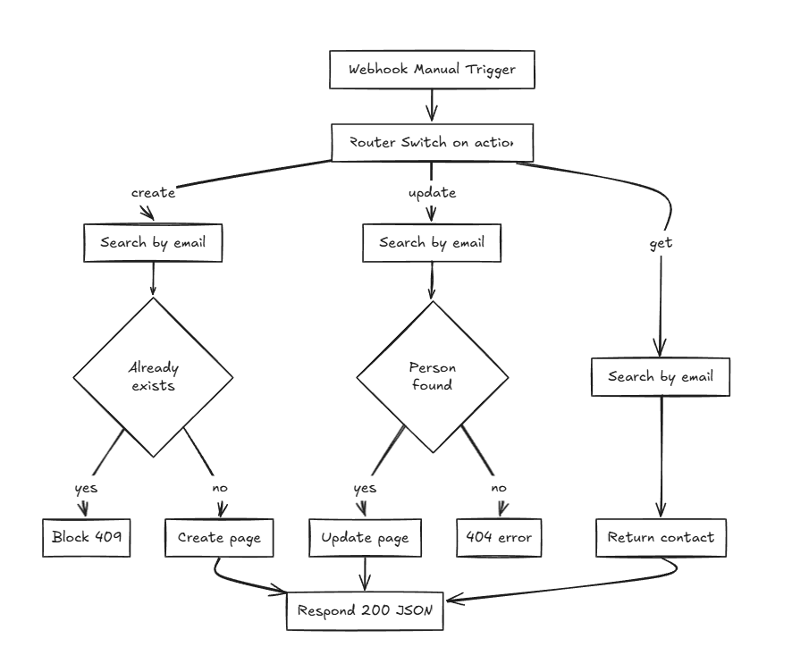

# 📇 Notion CRM API — n8n Template

> Add, update, and fetch contacts from a Notion database via a single webhook endpoint. Email is the only identifier needed — no Notion page IDs required.

**Published on the [n8n Creator Hub]([https://n8n.io/creators/tmakkar/](https://n8n.io/workflows/14304-add-update-and-fetch-contacts-from-a-notion-database-by-email/)) · 150+ views in 17 days.**

---

## What It Does

One endpoint, three operations — controlled by a single `action` field in the JSON payload.

| Action | Behaviour |
|---|---|
| `create` | Searches for existing email first. Blocks if duplicate. Creates new Notion page if email is new. |
| `update` | Finds contact by email automatically (no page ID needed). Updates all fields. Returns 404 if not found. |
| `get` | Searches by email. Returns full Notion page properties as JSON. |

---

## Architecture



---

## Node Reference

| Node | Purpose |
|---|---|
| `Manual Trigger / Webhook` | Entry point — accepts JSON payload with `action` field |
| `Router (Switch)` | Routes to create / update / get branch |
| `Search — Email Exists?` | (create) Queries Notion to check for duplicate email |
| `Already Exists?` | (create) IF: id not empty → block; else → create |
| `Block Duplicate` | Returns `409` error: "Use action: update instead" |
| `Notion — Create Person` | Creates new Notion database page with all 5 fields |
| `Search — Find by Email` | (update) Resolves page ID from email |
| `Person Found?` | (update) IF: id not empty → update; else → 404 |
| `Not Found Error` | Returns `404` error: "Use action: create instead" |
| `Notion — Update Person` | Updates existing page using resolved page ID |
| `Notion — Get Person` | (get) Fetches page by email, returns all properties |
| `Respond` | Single response node for all branches — 200 JSON |

---

## Notion Database Schema

Your Notion database needs these exact columns:

| Column | Notion type |
|---|---|
| `Name` | Title |
| `Email` | Email |
| `Phone` | Phone number |
| `Status` | Select (Lead · Contacted · Qualified · Customer · Closed) |
| `Notes` | Text |

---

## Sample Payloads

**Create a contact:**
```json
{
  "action": "create",
  "name": "Jane Doe",
  "email": "jane.doe@example.com",
  "phone": "+49 123 456 789",
  "status": "Lead",
  "notes": "Met at Berlin conference"
}
```

**Update a contact:**
```json
{
  "action": "update",
  "email": "jane.doe@example.com",
  "name": "Jane Doe",
  "phone": "+49 123 456 789",
  "status": "Customer",
  "notes": "Signed contract on March 24"
}
```

**Fetch a contact:**
```json
{
  "action": "get",
  "email": "jane.doe@example.com"
}
```

---

## Setup

1. Import the workflow JSON into n8n
2. Go to **Credentials → New → Notion API** → paste your integration token
3. In Notion: open your database → `...` → Connections → add your integration
4. Open each Notion node in the workflow and select your database from the dropdown
5. Test using the Manual Trigger with the sample payloads above
6. Go live: replace the Manual Trigger with a Webhook node and point your form or app at the generated URL

---

## Notes

- `status` values are case-sensitive — send `Lead` not `lead`
- Every contact must have a unique email address
- The update action returns an error if the email is not found — run create first
- The get action returns one contact per email lookup
- Works with any frontend that can send a POST request: React, plain HTML, Webflow, Bubble, Zapier, Make

---

## Template

This workflow is published on the n8n Creator Hub. You can use it directly from there without downloading the JSON:
👉 [View on n8n Creator Hub]([https://n8n.io/creators/tmakkar/](https://n8n.io/workflows/14304-add-update-and-fetch-contacts-from-a-notion-database-by-email/))

---

## Tech Stack

- **n8n** — workflow automation engine
- **Notion API** — CRM database
